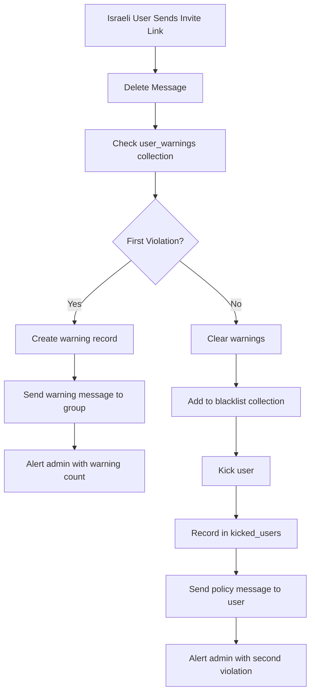
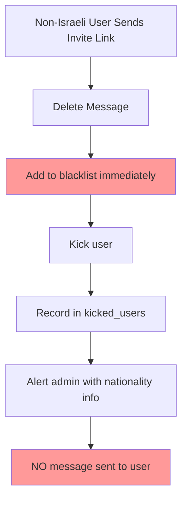

# Firebase Nationality-Based System Architecture

## Overview

The nationality-based warning system uses Firebase Firestore with three main collections to manage Israeli vs Non-Israeli user policies for invite link violations.

## Firebase Collections

### 1. `user_warnings` Collection
**Purpose**: Store warning records for Israeli users only (Non-Israeli users don't get warnings)

**Document Structure**:
```javascript
{
  userId: "972555123456", // Normalized phone without @s.whatsapp.net
  originalId: "972555123456@s.whatsapp.net", // Original WhatsApp ID
  groupId: "groupid@g.us", // WhatsApp group ID
  groupName: "My Group", // Human-readable group name
  inviteLink: "https://chat.whatsapp.com/ABC123", // The violating link
  lastWarned: "2025-08-06T10:00:00.000Z", // ISO timestamp
  warningCount: 1, // Number of warnings issued
  expiresAt: "2025-08-13T10:00:00.000Z", // Warning expiry (7 days)
  createdAt: "2025-08-06T10:00:00.000Z" // First warning timestamp
}
```

**Document ID**: `{normalizedUserId}:{groupId}` (e.g., `972555123456:groupid@g.us`)

**Nationality Logic**:
- ✅ **Israeli users (+972)**: Records created and maintained
- ❌ **Non-Israeli users**: NO records created (immediate kick policy)

### 2. `blacklist` Collection  
**Purpose**: Store all blacklisted users (both Israeli and Non-Israeli) with reason tracking

**Document Structure**:
```javascript
{
  userId: "1555123456@s.whatsapp.net", // Full WhatsApp ID
  reason: "Non-Israeli user sent invite link - immediate kick", // Detailed reason
  timestamp: "2025-08-06T10:00:00.000Z", // When blacklisted
  nationality: "non-israeli" | "israeli", // Derived from phone prefix
  violationType: "immediate_kick" | "second_warning", // Action type
  groupContext: "Group Name" // Where violation occurred
}
```

**Nationality-Specific Reasons**:
- **Israeli users**: `"Israeli user - Second invite link violation - kicked after warning"`
- **Non-Israeli users**: `"Non-Israeli user sent invite link - immediate kick"`

### 3. `kicked_users` Collection
**Purpose**: Store ALL kicked users for rejoin link system (both Israeli and Non-Israeli)

**Document Structure**:
```javascript
{
  userId: "1555123456", // Normalized ID
  originalId: "1555123456@s.whatsapp.net", // Original WhatsApp ID
  groupId: "groupid@g.us",
  groupName: "My Group",
  groupInviteLink: "https://chat.whatsapp.com/XYZ789",
  adminList: [
    {
      id: "972555987654@s.whatsapp.net",
      name: "+972555987654",
      phone: "972555987654", 
      isLID: false
    }
  ],
  kickedAt: "2025-08-06T10:00:00.000Z",
  reason: "Israeli user - Second invite link violation" | "Non-Israeli user - Immediate kick for invite link",
  canRejoin: false, // Set to true when unblacklisted via #free
  rejoinedAt: null,
  nationality: "israeli" | "non-israeli", // Derived from phone
  kickType: "immediate" | "after_warning" // Type of kick
}
```

**Document ID**: `{normalizedUserId}:{groupId}`

## Data Flow Analysis

### Israeli User Flow (+972 prefix)


### Non-Israeli User Flow (All other prefixes)


## Database Performance Considerations

### Indexes Required
```javascript
// user_warnings collection
{
  "userId": 1,
  "expiresAt": 1
}

// blacklist collection  
{
  "userId": 1,
  "nationality": 1
}

// kicked_users collection
{
  "userId": 1, 
  "canRejoin": 1
}
```

### Cleanup Operations

**Automatic Cleanup**:
- `user_warnings`: Expired warnings (>7 days) cleaned automatically
- `kicked_users`: Records with `rejoinedAt` >90 days cleaned automatically  
- `blacklist`: No automatic cleanup (permanent records)

### Storage Estimates

**Per Israeli User Warning**:
- Document size: ~200 bytes
- TTL: 7 days
- Estimated: 1,000 active Israeli users = 200KB

**Per Kicked User Record**:
- Document size: ~500 bytes (includes admin list)
- Retention: Until rejoined + 90 days
- Estimated: 10,000 kicked users = 5MB

**Per Blacklist Entry**:
- Document size: ~150 bytes
- Retention: Permanent
- Estimated: 50,000 blacklisted users = 7.5MB

**Total Estimated Storage**: <15MB for moderate usage

## Analytics Queries

### Nationality-Based Statistics
```javascript
// Count warnings by nationality (Israeli only)
db.collection('user_warnings')
  .where('userId', '>=', '972')
  .where('userId', '<', '973')
  .get()

// Count immediate kicks (Non-Israeli)  
db.collection('blacklist')
  .where('nationality', '==', 'non-israeli')
  .where('violationType', '==', 'immediate_kick')
  .get()

// Rejoin success rate by nationality
db.collection('kicked_users')
  .where('nationality', '==', 'israeli')
  .where('rejoinedAt', '!=', null)
  .get()
```

### Performance Monitoring
```javascript
// Warning system efficiency
db.collection('user_warnings')
  .where('warningCount', '==', 1) // Users who got warnings
  .get()

db.collection('kicked_users')  
  .where('reason', '==', 'Israeli user - Second invite link violation')
  .get() // Users who were kicked after warnings
```

## Security Considerations

### Data Privacy
- Phone numbers stored normalized (without country prefixes)
- Original IDs preserved for WhatsApp compatibility
- Admin information includes LID handling for privacy

### Access Control
- Service account key required for all operations
- Read/write permissions restricted to bot service
- No direct user access to warning/blacklist data

## Migration Notes

### From Previous System
- Legacy blacklist entries maintained compatibility
- New nationality field populated on first access
- Existing kicked users enhanced with nationality detection

### Future Considerations  
- Consider partitioning by nationality for scale
- Implement region-specific warning policies
- Add appeal system for permanent blacklists

## Error Handling

### Firebase Connection Loss
- Graceful degradation to memory-only mode
- Automatic reconnection and sync
- No data loss during outages

### Data Consistency
- Atomic operations for kick+blacklist
- Verification loops after critical operations
- Rollback capabilities for failed transactions